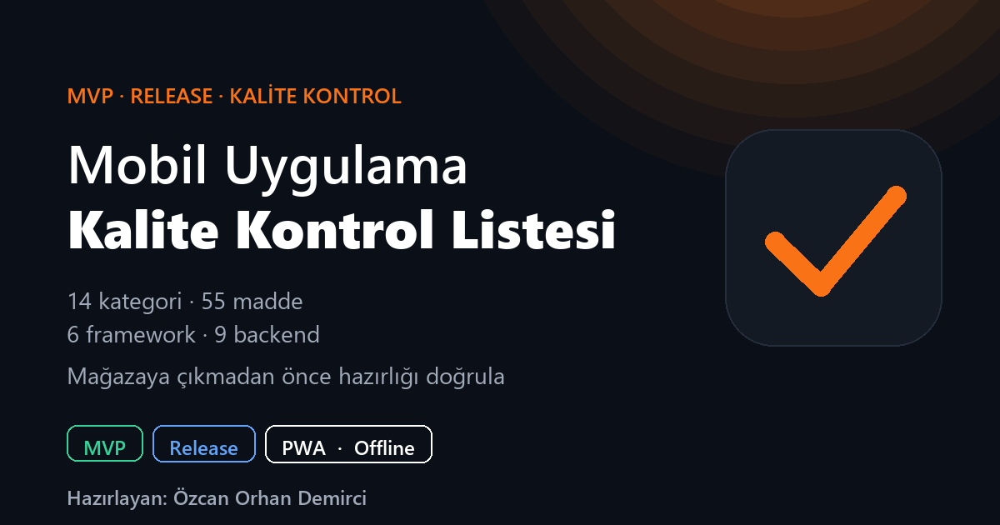

<div align="center">

# Mobile App Quality Checklist

[Türkçe](README.md) · **English**

**An interactive 14-category, 55-item quality checklist written so that nothing is left undone
before you submit your mobile app to the App Store / Play Store.**
*Mobil Uygulama Kalite Kontrol Listesi · MVP and Release tiers · per-framework + per-backend guidance · installable PWA.*

[](LICENSE)
[](https://ozcanorhandemirci.github.io/Mobil_App_Check_List/)
[](https://ozcanorhandemirci.github.io/Mobil_App_Check_List/)
[](#architectural-decisions)
[](#features)
[](#supported-frameworks-and-backends)
[](#supported-frameworks-and-backends)

<br />

<a href="https://ozcanorhandemirci.github.io/Mobil_App_Check_List/">
  
</a>

<br /><br />

**[Live Demo](https://ozcanorhandemirci.github.io/Mobil_App_Check_List/)** ·
**[Features](#features)** ·
**[Architecture](#architecture)** ·
**[Data Model](#data-model)** ·
**[Extending](#extending)** ·
**[License](#license)**

</div>

---

## Table of contents

- [Why does it exist?](#why-does-it-exist)
- [Features](#features)
- [Quick start](#quick-start)
- [Browser support](#browser-support)
- [Architecture](#architecture)
  - [Tech stack](#tech-stack)
  - [Four-axis content resolver](#four-axis-content-resolver)
  - [Modular file layout](#modular-file-layout)
  - [PWA strategy](#pwa-strategy)
- [Project layout](#project-layout)
- [Data model](#data-model)
- [Extending](#extending)
- [Supported frameworks and backends](#supported-frameworks-and-backends)
- [Architectural decisions](#architectural-decisions)
- [User data and privacy](#user-data-and-privacy)
- [Performance](#performance)
- [Roadmap](#roadmap)
- [Contributing](#contributing)
- [License](#license)
- [Author](#author)

---

## Why does it exist?

For developers, hobby builders, and especially people writing apps with AI-assisted code generators (Cursor, Claude, ChatGPT, etc.), the **pre-store-submission checklist** is scattered, incomplete, and largely intuitive. There are countless blog posts that recommend 100 items just to start building a single feature; but there is no tool that answers the question "am I ready to ship, what did I forget?" **in one place, interactively, as a reminder.**

This app fills that gap:

- **The 55 items you might miss because you're not a seasoned developer** are written down here.
- Each item is rated at **two tiers**: MVP (smallest working product) and Release (ready for store approval).
- Each item includes a **step-by-step how-to guide**, ready to paste into an AI assistant.
- The content adapts to **your tech stack**: Flutter or Swift? Firebase or Supabase? The code examples change accordingly.
- Available in **Turkish and English**, with **Simple** or **Technical** wording.
- An installable browser app (PWA) that works without internet, too.

> **Target audience:** indie developers, students, university projects, hackathon teams, bootcamp participants, semi-technical users building with AI assistants, and teams who want to pass store approval on the first try.

---

## Features

<table>
<tr>
<td width="50%" valign="top">

### Content

- **14 categories**, **55 items**: planning, design, code layout, Git, API, backend, offline, testing, security, accessibility, release, monetization, analytics, CI/CD
- Each item is checked at **two tiers** (MVP / Release)
- A **step-by-step how-to guide** for each item (on the back of the card)
- Steps are **individually checkable**; progress percentage is computed automatically
- **2 languages** (TR · EN) · **2 explanation styles** (Simple · Technical)
- **2 usage modes**: Development (I'm building my own app) · Review (I'm auditing someone else's app)

</td>
<td width="50%" valign="top">

### Adaptive content

- **6 frameworks** supported: Flutter · React Native · Swift (iOS) · Kotlin (Android) · Expo · PWA
- **9 backends** supported: Firebase · Supabase · Appwrite · PocketBase · AWS Amplify · Convex · Self-hosted server · Local dev · No backend
- Content **changes automatically** with the selected combination: package names, code samples, install commands
- When "No backend" is selected, **irrelevant items are hidden entirely**
- **AI-ready prompt generator**: serves the item content and the user's choices as paste-ready markdown / JSON for any AI assistant

</td>
</tr>
<tr>
<td valign="top">

### Multi-project

- Manage **up to 20 projects** in the same list
- Each project keeps its own **marks, notes, and stack**
- **Instant switching** between projects (via the hero pill)
- **JSON export / import**: back up your marks and notes, continue on another device

</td>
<td valign="top">

### View and interaction

- **Light / dark theme** (adapts to system preference)
- **Search**: instant text search across all 55 items (focus with the `/` key)
- **Filter**: To do / Done / All × MVP / Release / Both
- **Presentation mode** (`P` key): one click into a full-screen, projector-friendly view
- **Print / PDF**: both checklist and How-To guide formats
- **One-click install**: pin to the home screen / start menu
- **Works offline**: Service Worker cache, opens even when the internet drops
- **A11y**: high-contrast palette, keyboard navigation, focus-visible outlines, semantic ARIA roles

</td>
</tr>
</table>

---

## Quick start

### 1. Use it in your browser

The easiest path: open the live demo.

> [https://ozcanorhandemirci.github.io/Mobil_App_Check_List/](https://ozcanorhandemirci.github.io/Mobil_App_Check_List/)

On first launch, a **7-step welcome flow** asks for language, usage mode, explanation style, project name, framework, and backend. You're off in a few clicks.

### 2. Install on your device (PWA)

| Platform | Step |
|---|---|
| **Android / Chrome** | The **Install** icon next to the address bar, or *"Add to Home screen"* from the menu |
| **iOS / Safari** | Share button → **Add to Home Screen** |
| **Windows / Edge** | The **Install** icon in the address bar, or *Settings → Apps → Install this site as an app* |
| **macOS / Chrome** | The **Install** icon in the address bar |

After installation it opens in **standalone** mode (no browser chrome), works **offline**, and lives in the **dock / start menu** with its own icon.

### 3. Run locally

No build step. Just static files.

```bash
# Clone the repo
git clone https://github.com/OzcanOrhanDemirci/Mobil_App_Check_List.git
cd Mobil_App_Check_List

# Start a local server (Service Worker won't run over file://)
python -m http.server 8080
# or
npx serve .

# Then in your browser:
# http://localhost:8080
```

### 4. Publish to your own GitHub Pages

1. **Fork** the repo.
2. *Settings → Pages → Source: `main` / `(root)`*.
3. Within 1-2 minutes it goes live at `https://<your-username>.github.io/Mobil_App_Check_List/`.

If you want a custom domain, add a `CNAME` file; no extra configuration needed.

---

## Browser support

| Browser | Version | PWA install | Offline |
|---|---|---|---|
| Chrome / Edge (desktop and mobile) | 90+ | Yes | Yes |
| Safari (iOS and macOS) | 15+ | Yes (Add to Home Screen) | Yes |
| Firefox (desktop and mobile) | 90+ | Limited (mobile only) | Yes |
| Samsung Internet | 14+ | Yes | Yes |
| Opera | latest | Yes | Yes |

> Uses ES2020+ syntax, CSS custom properties, Service Worker, and localStorage. Internet Explorer is **not supported**.

---

## Architecture

### Tech stack

| Layer | Choice | Why |
|---|---|---|
| HTML | A single `index.html` (~1100 lines) | One PWA entry point; all modals are inline static HTML that JS shows / hides. |
| CSS | 6 files, vanilla CSS | No build tool. Theme switching via CSS custom properties. Print styles in a dedicated file. |
| JS | 16 files, vanilla ES2020+ | No build / transpile / bundling. Loaded sequentially via `<script>` tags (numbered filenames define the order). |
| Data | A single `DATA` constant (`js/03-data.js`) | 14 categories × 55 items with language / style / framework / backend variants. A pure static JS object; no build or fetch. |
| Service Worker | Network-first + cache fallback | `sw.js` ~30 lines; every same-origin GET tries the network first, successful responses are cached, on network failure the last cached version is served. |
| Storage | `localStorage` | All user data (marks, notes, projects) stays in the browser; nothing is sent to a server. |

### Four-axis content resolver

The same item can look different across **four axes**, depending on the user's choices:

```
Rendered content = f(language, explanation style, framework, backend)
                     TR/EN     Simple/Technical    6 options   9 options
```

The theoretical maximum is **216 combinations** (`2 × 2 × 6 × 9`); but you don't need to write each of them for every item. A **priority chain** means only the content that **genuinely differs** has to be written:

```js
// js/05-framework.js
function resolveLevel(feature, level /* "mvp" | "release" */) {
  // A) When style === "simple", try plain texts first
  if (currentStyle === "simple") {
    if (feature.simpleBackend?.[currentBackend]?.[level]) {
      return feature.simpleBackend[currentBackend][level];   // most specific
    }
    if (feature.simple?.[level]) {
      return feature.simple[level];                          // plain text shared across the stack
    }
    // if no plain text exists, fall through to technical content
  }

  // B) Technical (default) order
  if (feature.backendVariants?.[currentBackend]) {
    const node = feature.backendVariants[currentBackend];
    if (node[currentFramework]?.[level]) return node[currentFramework][level];
    if (node._default?.[level])         return node._default[level];
  }
  if (feature.variants?.[currentFramework]?.[level]) {
    return feature.variants[currentFramework][level];
  }
  return feature[level];                                     // most general
}
```

That way an item is written **once** and specialized **only where needed**. A typical item defines 3-4 variants; none of the 216 combinations renders as "empty".

### Modular file layout

JS files load in order; each file has a **single responsibility**:

```
01-i18n-strings.js   UI string dictionary (TR/EN), t() and tx() resolvers
02-help-content.js   HTML content of the Help modal
03-data.js           14 categories, 55 items, all variants (~3000 lines)
04-projects.js       Multi-project storage (20-project limit, migrations)
04-storage.js        Mark / note / open-closed state wrapper
05-framework.js      6 framework definitions + the four-axis resolver
05-backend.js        9 backend definitions + "No backend" hiding logic
06-view-state.js     currentFramework / currentBackend / view mode
07-ui-helpers.js     Theme, modal helpers, toast
08-i18n-dom.js       Apply i18n to the DOM, switch languages
09-ai-prompt.js      Markdown + JSON AI prompt generator
10-clipboard.js      Clipboard helper
11-render.js         Main render loop, card template
12-progress.js       Percentage calculation, celebrations
13-filters.js        Search + 3×3 view filter
14-app.js            Orchestration, welcome flow, reset, init
```

No build tool, no transpilation, no runtime dependency. A new developer (or AI assistant) can grasp the project **in minutes**.

### PWA strategy

- `manifest.webmanifest` enables standalone mode and defines the icons (inline SVG, both `any` and `maskable`).
- `sw.js` uses a **network-first + cache fallback** strategy: every same-origin GET first goes to the network, successful responses are written to the `mobil-kontrol-v3` cache; when the network is unreachable, the last cached version is served instantly. Stale cache keys are cleaned up automatically on `activate`.
- If `./sw.js` cannot be loaded (e.g. single-file scenarios opened over `file://`), JS attempts to register a **fallback Service Worker via a blob URL**; if Chromium rejects blob-URL SWs it fails silently.
- When served over HTTPS, Chrome / Edge / Safari automatically surface the "Install" prompt.

---

## Project layout

```text
Mobil_App_Check_List/
├── index.html                Single page: modals + script loading order
├── manifest.webmanifest      PWA manifest (name, icons, theme color, scope)
├── sw.js                     Service Worker (network-first + offline fallback)
├── og-image.png              1200×630 social media preview image
├── .nojekyll                 Disables GitHub Pages Jekyll processing
├── .gitignore                Local tool artifacts (OS / editor leftovers)
├── LICENSE                   MIT
├── README.md                 Turkish (primary)
├── README.en.md              English
├── css/
│   ├── 01-base.css           Reset, CSS custom properties, base typography
│   ├── 02-layout.css         Hero, page layout, project pill
│   ├── 03-categories.css     Category cards, item cards, flip
│   ├── 04-presentation.css   Presentation mode (full-screen focus)
│   ├── 05-modals.css         All modals, welcome flow, grids
│   └── 06-responsive-print.css Mobile + tablet + desktop + print
└── js/
    └── 16 files (see the table above)
```

---

## Data model

A feature has evolved in a fully backwards-compatible way. All fields are optional; the resolver fills missing ones from upper layers:

```js
{
  id: "6.1",
  title: { tr: "...", en: "..." },
  desc:  { tr: "...", en: "..." },

  // 1) Universal fallback: shown unless a framework / backend / style overrides it
  mvp:     { tr: "...", en: "..." },
  release: { tr: "...", en: "..." },

  // 2) Framework-axis variants
  variants: {
    flutter:     { mvp: {tr, en}, release: {tr, en} },
    reactNative: { ... },
    swift:       { ... },
    kotlin:      { ... },
    expo:        { ... },
    pwa:         { ... }
  },

  // 3) Backend-axis variants
  backendStep: true,           // if true, the item is fully hidden when "No backend" is selected
  backendVariants: {
    firebase: {
      _default: { mvp, release },              // backend-general
      flutter:  { mvp, release },              // optional framework override
      reactNative: { ... },
    },
    supabase:  { _default: { ... } },
    appwrite:  { _default: { ... } },
    // ...
  },

  // 4) Texts shown when the explanation style is "Simple"
  simple: {
    mvp:     { tr: "...", en: "..." },
    release: { tr: "...", en: "..." }
  },
  // Optional: backend-specific plain text (e.g. a special note for "No backend")
  simpleBackend: {
    noBackend: {
      mvp:     { tr, en },
      release: { tr, en }
    }
  }
}
```

**Resolution priority (`resolveLevel`):**

```
If style === "Simple":
  1. simpleBackend[backend][level]        → most specific
  2. simple[level]                        → plain text shared across the stack

Technical (default) order:
  3. backendVariants[backend][framework][level]
  4. backendVariants[backend]._default[level]
  5. variants[framework][level]
  6. feature[level]                       → most general
```

> So **all 216 combinations of an item** can usually be filled with just 2-4 text blocks. A single "simple" block automatically covers 108 (6×9×2) combinations on its own; backend-specific content is written only where it genuinely matters.

---

## Extending

### Adding a new item

Add an object to the `features` array of the appropriate category in `js/03-data.js`:

```js
{
  id: "6.7",
  title: { tr: "Webhook entegrasyonu", en: "Webhook integration" },
  desc:  { tr: "Backend olaylarını dışarı haberleştir.",
           en: "Notify external services of backend events." },
  mvp:     { tr: "...", en: "..." },
  release: { tr: "...", en: "..." },
  howto: {
    mvp:     { tr: "1) ...", en: "1) ..." },
    release: { tr: "1) ...", en: "1) ..." }
  }
}
```

The item shows up immediately on both the front and the back (How-To) face of the card. If it depends on a backend, add `backendStep: true`: when "No backend" is selected it disappears automatically.

### Adding a new framework

1. `js/05-framework.js` → `VALID_FRAMEWORKS` + `FRAMEWORK_META` (label / short name / icon / AI prompt) + `INSTALL_EXAMPLES` + `SETUP_ASSUMPTIONS`.
2. `js/05-backend.js` → add a `BACKEND_INSTALL_EXAMPLES.{backend}.{new-framework}` entry for every backend.
3. In `index.html`, add a card to the welcome (`data-welcome-fw="..."`), framework switcher (`data-switch-fw="..."`), and new-project (`data-add-fw="..."`) grids.

**Most** existing items will automatically fall back to the universal value for the new framework (because `variants[framework]` is undefined). Fill in `variants[new-framework]` or `backendVariants[*][new-framework]` only where a framework-specific code example is genuinely required.

### Adding a new backend

Same pattern: `js/05-backend.js` → `VALID_BACKENDS` + `BACKEND_META` + `BACKEND_INSTALL_EXAMPLES` + `BACKEND_SETUP_ASSUMPTIONS`. In `index.html`, add a card to the welcome (`data-welcome-be="..."`) and backend switcher (`data-switch-be="..."`) grids. For the backend-dependent parts of items, write `backendVariants.{new-backend}._default` blocks.

### Adding a new language

1. `js/01-i18n-strings.js` → add the new-language counterpart of every key to the `UI_STRINGS` object (e.g. `de` for German).
2. `js/03-data.js` → next to every `{tr, en}` pair, add a `de` field.
3. Extend the language pill in the hero and `applyI18nToDom` to recognize the new key.

Because the resolver simply returns `obj[currentLang]`, the addition is structurally risk-free.

---

## Supported frameworks and backends

<table>
<tr>
<th>Framework</th>
<th>Icon</th>
<th>AI prompt label</th>
<th>Welcome label</th>
</tr>
<tr><td>Flutter</td><td>🐦</td><td>Flutter / Dart</td><td>Flutter</td></tr>
<tr><td>React Native</td><td>⚛</td><td>React Native (bare / CLI) / TypeScript</td><td>React Native</td></tr>
<tr><td>Swift (iOS)</td><td>🍎</td><td>Swift / SwiftUI (Native iOS)</td><td>Swift</td></tr>
<tr><td>Kotlin (Android)</td><td>🤖</td><td>Kotlin / Jetpack Compose (Native Android)</td><td>Kotlin</td></tr>
<tr><td>Expo</td><td>🚀</td><td>Expo SDK (CNG, dev client, EAS Build)</td><td>Expo</td></tr>
<tr><td>PWA</td><td>🌐</td><td>Progressive Web App (HTML/CSS/JS)</td><td>PWA</td></tr>
</table>

<table>
<tr>
<th>Backend</th>
<th>Icon</th>
<th>Description</th>
</tr>
<tr><td>Firebase</td><td>🔥</td><td>Google's BaaS: Auth + Firestore + Storage + Cloud Functions + App Check + FCM</td></tr>
<tr><td>Supabase</td><td>🟢</td><td>Open-source Firebase alternative: Postgres + Row Level Security + Realtime + Edge Functions</td></tr>
<tr><td>Appwrite</td><td>🟣</td><td>Open-source BaaS on self-host or Appwrite Cloud</td></tr>
<tr><td>PocketBase</td><td>📦</td><td>Single binary, SQLite-backed; ideal for small to medium projects</td></tr>
<tr><td>AWS Amplify</td><td>☁️</td><td>Amplify Gen 2 (TypeScript): Cognito + DynamoDB/AppSync + S3 + Lambda</td></tr>
<tr><td>Convex</td><td>⚡</td><td>TypeScript-first reactive backend (end-to-end typed queries/mutations)</td></tr>
<tr><td>Self-hosted server</td><td>🛠️</td><td>Your own REST/GraphQL API (Node/Python/Go/Rust/Ruby/.NET)</td></tr>
<tr><td>Local dev</td><td>💻</td><td>Development server on localhost / LAN (not recommended for production)</td></tr>
<tr><td>No backend</td><td>🚫</td><td>Fully client-side; items that require a backend are hidden automatically</td></tr>
</table>

---

## Architectural decisions

<details>
<summary><strong>Why no build step?</strong></summary>

<br />

This is a deliberate decision that makes the project easy to maintain and easy to contribute to:

- A new contributor runs `git clone` and opens `index.html`. Done.
- No dependency upgrades, no lock-file conflicts, no `node_modules`.
- "Build error" is not a concept here; the browser runs the code as-is.
- Edit a file, refresh the page, see the result.
- It will still work the same way 5 years from now, even if build-tool dependencies break across the ecosystem.

The counter-argument: bundle size and performance. The entire static payload (HTML + CSS + JS) is **~380 KB** gzipped, most of it coming from the content data file that carries 55 items × four-axis variants. After the first visit, the Service Worker cache nearly eliminates network traffic.

</details>

<details>
<summary><strong>Why vanilla JS / CSS, no framework?</strong></summary>

<br />

- **Small scope**: a single checklist page; no real complexity that React would solve.
- **Low barrier to entry**: anyone who knows HTML / CSS / JS can contribute; no obligation to learn React / Vue / Svelte.
- **Load time**: no framework overhead; the first render is instant.
- **Nothing missing**: state management, rendering, event delegation, and history are all comfortably handled with vanilla code.

The cost of this simple decision: the codebase is **lightly abstracted**; `index.html` is 1100 lines, the longest JS file is 3000 lines. In return, all the work is visible and readable.

</details>

<details>
<summary><strong>Why all the data in a single <code>DATA</code> constant?</strong></summary>

<br />

`js/03-data.js`, which carries 55 items × four-axis (language × style × framework × backend) variants, is ~835 KB raw. At first glance you might say "this should be lazy-loaded." We didn't, because:

- Users come to see **the whole list**, not just **a few items**: search, filtering, and presentation mode only make sense with the full list in memory.
- All assets are ~380 KB gzipped; most connections download it in sub-second time.
- The Service Worker fills its cache after a single successful visit; the app opens even when the internet is gone.
- A lazy-loading architecture (per-category files, dynamic imports, etc.) would require a build step, breaking the "vanilla JS" decision.

If the data grows considerably (e.g. 200 items), this decision should be revisited.

</details>

<details>
<summary><strong>Why <code>localStorage</code> (not IndexedDB)?</strong></summary>

<br />

All user data (marks, notes, projects) sits in **a few KB total**. The async / transaction overhead IndexedDB brings is unnecessary at this size.

The advantage of `localStorage`'s synchronous API: it can be read directly during render, so when the page reloads the correct state is visible on the very first frame. Doing the same with IndexedDB requires extra state management.

Limit: ~5 MB / origin. Even 20 projects × hundreds of marks stays well under that.

</details>

<details>
<summary><strong>Why a CSS / JS file per category?</strong></summary>

<br />

So a developer working on a single feature can focus on **just one file**. Each filename (`01-base.css`, `11-render.js`, etc.) describes its responsibility; the order is also deterministic because of the `<link>` and `<script>` tag sequence.

With HTTP/2, many small files are **not meaningfully slower** than a single bundle. If a real performance issue ever appears, a minify + concat script can be added in an evening.

</details>

<details>
<summary><strong>Why a Simple / Technical explanation style?</strong></summary>

<br />

Modern app development has become **AI-assisted**, and a **substantial portion** of the people building apps are not from the software world. A teacher, a lawyer, a shopkeeper can write apps with Cursor / Claude; but when they read an item like "Riverpod 3.x AsyncNotifier" they close the page.

The **Simple** style avoids package names, version numbers, acronyms, and file paths; it uses everyday metaphors ("the phone's secure drawer", "screen reader"). The **Technical** style gives full detail.

The same content is shown with **different wording** depending on the user's choice. This is one of the product's most distinctive differences.

</details>

---

## User data and privacy

- **No data leaves your device.** All marks, notes, and project configurations live **only in your browser** (`localStorage`).
- **No analytics**, **no cookies**, **no third-party trackers**.
- Use **JSON export / import** to move your data to another device.
- **Reset** is always one click away.
- AI prompts you send only exist when you copy them yourself; the app never autonomously sends data to any AI service.

---

## Performance

| Metric | Target | Current |
|---|---|---|
| LCP (Largest Contentful Paint) | < 2.5 s | ~1.2 s (4G, cold cache) |
| CLS (Cumulative Layout Shift) | < 0.1 | ~0.02 |
| INP (Interaction to Next Paint) | < 200 ms | ~80 ms |
| Total assets (raw) | - | ~1.45 MB |
| Total assets (gzipped) | - | ~380 KB |
| Offline launch (SW cache) | - | Works |
| Runtime dependency | - | Zero |

> Most of the asset payload comes from `js/03-data.js`, the four-axis multi-variant content library; the application logic (`14-app.js`) alone is under 30 KB gzipped. Target Lighthouse ranges on the mobile profile: Performance 95+, Accessibility 95+, Best Practices 100, SEO 100.

---

## Roadmap

Improvements that may be worth picking up (*all open to contribution; everything can come in as a pull request*):

- [ ] **More languages**: German, Spanish, French, Arabic (with RTL)
- [ ] **Industry packs**: regional compliance items for e-commerce, healthcare, gaming, fintech (GDPR / HIPAA / PCI DSS / KVKK)
- [ ] **Team mode**: sync the same list across team members (optional, with your own backend)
- [ ] **Markdown export**: deliverable as a report
- [ ] **Comments per item**: separate from personal notes, visible to the team
- [ ] **More frameworks**: Ionic, NativeScript, .NET MAUI, Tauri
- [ ] **More backends**: Hasura, Strapi, Directus, Nhost
- [ ] **Time-based history**: a graph of which item was checked when

---

## Contributing

Contributions are welcome. Suggested workflow:

1. **Fork** the repo.
2. **Open an issue** or comment on an existing one; mention that you'll work on it.
3. Cut a **feature branch** off `main`: `git checkout -b feat/new-item-x-y`.
4. Make the change; keep it small and focused.
5. Stay consistent with the existing style:
   - JS: ES2020+, a short JSDoc-like comment at the top of each function.
   - CSS: into the relevant category file, using custom properties.
   - Content (`js/03-data.js`): follow the shape and tone of existing items.
6. **Do not use em dash characters (`—`)**: this is a written-style rule for the project. Use `:`, `;`, or parentheses instead.
7. **Conventional commit messages**: `feat: ...`, `fix: ...`, `docs: ...`, `refactor: ...`.
8. When opening a PR, include a **short description** + a **screenshot** (if the UI changes).

### Tips for content contributions

- Before adding a new item: is it something a user could **actually** forget, and is it **critical** for store approval or user experience? Discuss with the maintainer (via issue) before adding.
- When adding code examples, reference **2024+ current** versions (Firebase BoM 34+, RN 0.76+ New Architecture, Expo SDK 53+).
- Avoid package names, version numbers, and acronyms in the Simple style; prefer everyday-life metaphors.
- Keep TR and EN in sync; TR-only commits are not accepted.

### Reporting bugs and ideas

[Open an issue](https://github.com/OzcanOrhanDemirci/Mobil_App_Check_List/issues/new): no template required, just keep it clean and clear. Reproduction steps and browser / device info help.

---

## License

[MIT](LICENSE) © 2026 Özcan Orhan Demirci

You can use, modify, and include this software in commercial projects for free. The only condition is that the copyright notice is preserved. See the `LICENSE` file for details.

---

## Author

**Özcan Orhan Demirci**

- GitHub: [@OzcanOrhanDemirci](https://github.com/OzcanOrhanDemirci)

If this project was useful to you, please **star** the repo, share it with your network, or make it better with your own contributions. Don't hesitate to open an issue with content or code ideas.

<br />

<div align="center">

**[↑ Back to top](#mobile-app-quality-checklist)**

</div>
