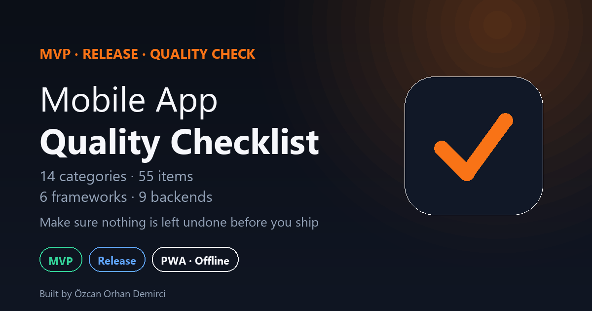
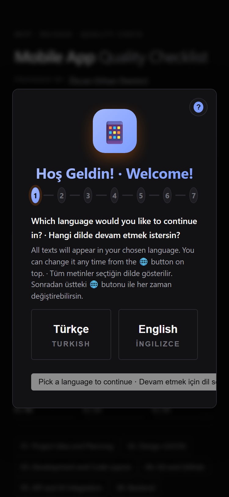
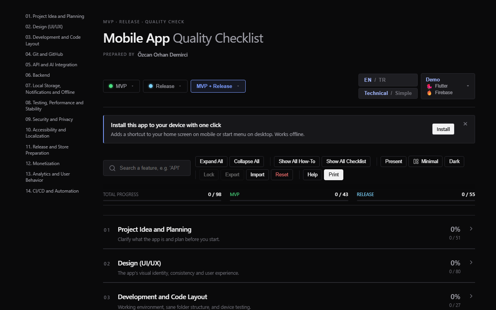
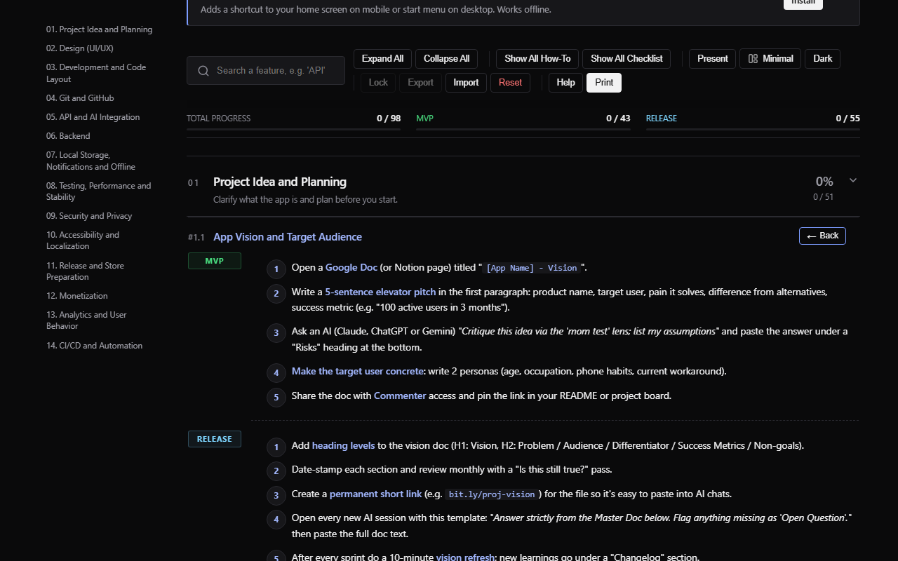
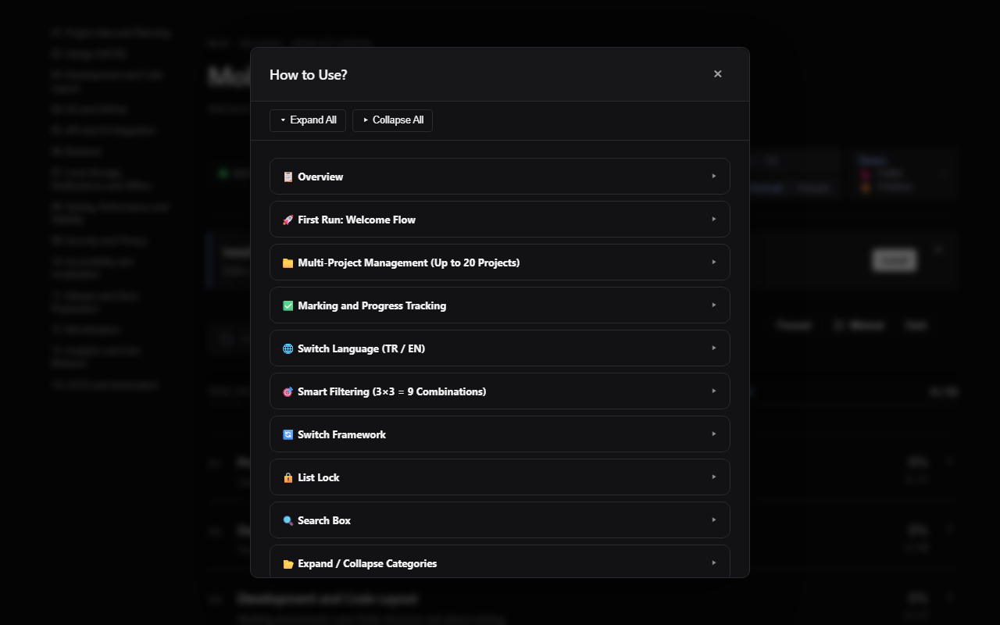
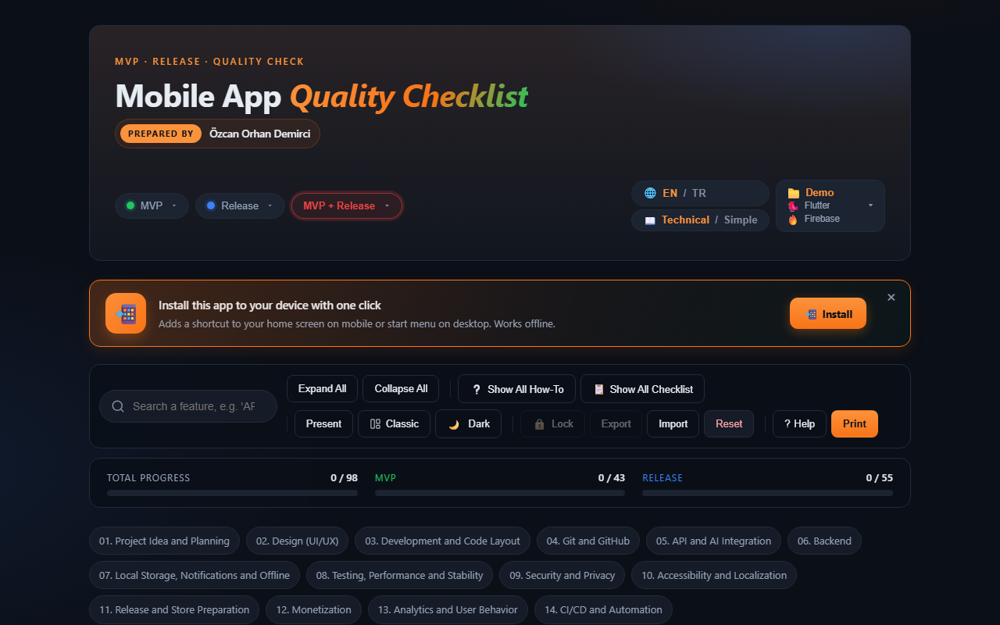
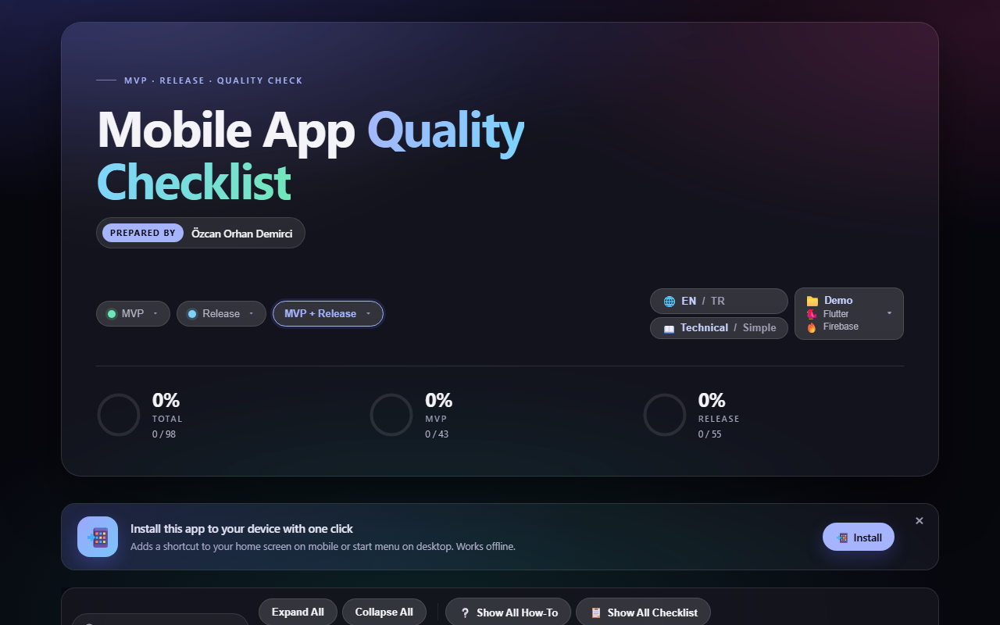
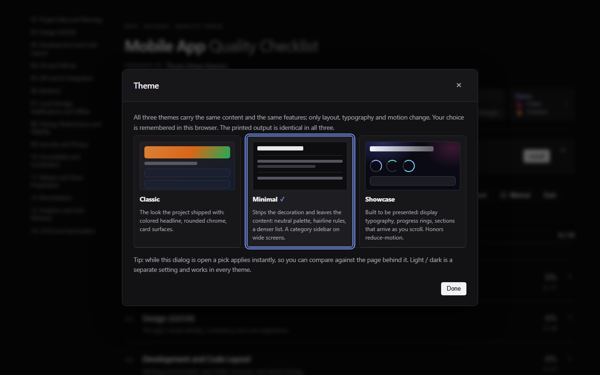

<div align="center">

# Mobile App Quality Checklist

[Türkçe](README.tr.md) · **English**

**An interactive 14-category, 55-item quality checklist designed so you don't forget anything
before you submit your mobile app to the App Store or Play Store.**
_Mobil Uygulama Kalite Kontrol Listesi · MVP and Release tiers · per-framework and per-backend guidance · installable PWA._

[](https://github.com/OzcanOrhanDemirci/Mobil_App_Check_List/releases/latest)
[](LICENSE)
[](https://github.com/OzcanOrhanDemirci/Mobil_App_Check_List/actions/workflows/ci.yml)
[](https://ozcanorhandemirci.github.io/Mobil_App_Check_List/)
[](https://ozcanorhandemirci.github.io/Mobil_App_Check_List/)
[](#architectural-decisions)
[](#features)
[](#design-themes)
[](#supported-frameworks-and-backends)
[](#supported-frameworks-and-backends)

<br />

<a href="https://ozcanorhandemirci.github.io/Mobil_App_Check_List/">
  
</a>

<br /><br />

**[Live Demo](https://ozcanorhandemirci.github.io/Mobil_App_Check_List/)** ·
**[Features](#features)** ·
**[Architecture](#architecture)** ·
**[Data Model](#data-model)** ·
**[Extending](#extending)** ·
**[License](#license)**

</div>

---

## Table of contents

- [Why does it exist?](#why-does-it-exist)
- [Features](#features)
- [Screenshots](#screenshots)
- [Quick start](#quick-start)
- [Design themes](#design-themes)
- [Browser support](#browser-support)
- [Architecture](#architecture)
  - [Tech stack](#tech-stack)
  - [Four-axis content resolver](#four-axis-content-resolver)
  - [Modular file layout](#modular-file-layout)
  - [Responsive scale and touch targets](#responsive-scale-and-touch-targets)
  - [PWA strategy](#pwa-strategy)
- [Project layout](#project-layout)
- [Data model](#data-model)
- [Extending](#extending)
- [Supported frameworks and backends](#supported-frameworks-and-backends)
- [Architectural decisions](#architectural-decisions)
- [User data and privacy](#user-data-and-privacy)
- [Performance](#performance)
- [Frequently asked questions](#frequently-asked-questions)
- [Roadmap](#roadmap)
- [Contributing](#contributing)
- [License](#license)
- [Author](#author)

---

## Why does it exist?

For developers, hobby builders, and especially people writing apps with AI-assisted code generators (Cursor, Claude, ChatGPT, etc.), the **pre-store-submission checklist** is scattered, incomplete, and largely intuitive. There are countless blog posts that recommend 100 items just to start building a single feature; but there is no tool that answers "am I ready to ship, what did I forget?" **all in one place, interactively, like a reminder.**

This app fills that gap:

- **The 55 items you might miss because you're not a seasoned developer** are written down here.
- Each item is rated at **two tiers**: MVP (smallest working product) and Release (ready for store approval).
- Each item ships with a **step-by-step how-to guide**, ready to paste into an AI assistant.
- The content adapts to **your tech stack**: Flutter or Swift? Firebase or Supabase? The code samples change accordingly.
- Available in **Turkish and English**, with **Simple** or **Technical** wording.
- An installable browser app (PWA) that also works offline.

> **Target audience:** indie developers, students, university projects, hackathon teams, bootcamp participants, semi-technical users building with AI assistants, and teams who want to pass store approval on the first try.

---

## Features

<table>
<tr>
<td width="50%" valign="top">

### Content

- **14 categories**, **55 items**: planning, design, code layout, Git, API, backend, offline, testing, security, accessibility, release, monetization, analytics, CI/CD
- Each item is checked at **two tiers** (MVP / Release)
- A **step-by-step how-to guide** for each item (on the back of the card)
- Steps are **individually checkable**; progress percentage is computed automatically
- **2 languages** (TR · EN) · **2 explanation styles** (Simple · Technical)
- **2 usage modes**: Development (I'm building my own app) · Review (I'm auditing someone else's app)

</td>
<td width="50%" valign="top">

### Adaptive content

- **6 frameworks** supported: Flutter · React Native · Swift (iOS) · Kotlin (Android) · Expo · PWA
- **9 backends** supported: Firebase · Supabase · Appwrite · PocketBase · AWS Amplify · Convex · Self-hosted server · Local dev · No backend
- Content **changes automatically** with the selected combination: package names, code samples, install commands
- When "No backend" is selected, **irrelevant items are hidden entirely**
- **AI-ready prompt generator**: serves the item content and the user's choices as paste-ready markdown / JSON for any AI assistant

</td>
</tr>
<tr>
<td valign="top">

### Multi-project

- Manage **up to 20 projects** in the same list
- Each project keeps its own **marks, notes, and stack**
- **Instant switching** between projects (via the hero pill)
- **JSON export / import**: back up your marks and notes, continue on another device

</td>
<td valign="top">

### View and interaction

- **3 design themes** (`T` key): Classic, Minimal, Showcase. Same content and same features in each; only layout, typography and motion change
- **Light / dark mode**, a separate axis: every theme works in both
- **Search**: instant text search across all 55 items (focus with the `/` key)
- **Filter**: To do / Done / All × MVP / Release / Both
- **Presentation mode** (`P` key): one click into a full-screen, projector-friendly view
- **Print / PDF**: both checklist and How-To guide formats
- **One-click install**: pin to the home screen / start menu
- **Works offline**: Service Worker cache, opens even when the internet drops, and a repeat visit opens from that cache in well under a second
- **Built for a phone**: a five-tier responsive scale down to 320px, 44x44 touch targets, safe-area insets, no horizontal scrolling at any width
- **A11y**: high-contrast palette, keyboard navigation, focus-visible outlines, semantic ARIA roles

</td>
</tr>
</table>

---

## Screenshots

<p align="center">
  <a href="https://ozcanorhandemirci.github.io/Mobil_App_Check_List/">
    
  </a>
  <br />
  <em>Social preview image (Open Graph, 1200x630). A Turkish version lives at <code>og-image.png</code>.</em>
</p>

> The screenshots below are generated by `scripts/capture-screenshots.mjs`, which drives Playwright against a local server. The PNGs under `assets/screenshots/` are committed; re-run the script after any UI change to refresh them (usage below). Shots 1 to 5 use the default theme; 6 and 7 pin their own, so the gallery always shows all three.

<table>
  <tr>
    <td align="center" width="50%">
      <a href="assets/screenshots/en/01-welcome.png">
        
      </a>
      <br />
      <sub><strong>1. Welcome</strong>: the intro modal shown on first run.</sub>
    </td>
    <td align="center" width="50%">
      <a href="assets/screenshots/en/02-checklist.png">
        
      </a>
      <br />
      <sub><strong>2. Main checklist</strong>: 14 categories, 55 items with MVP and Release filters.</sub>
    </td>
  </tr>
  <tr>
    <td align="center" width="50%">
      <a href="assets/screenshots/en/03-card-flip.png">
        
      </a>
      <br />
      <sub><strong>3. Card details</strong>: flipped card showing the step-by-step how-to guide.</sub>
    </td>
    <td align="center" width="50%">
      <a href="assets/screenshots/en/04-help.png">
        
      </a>
      <br />
      <sub><strong>4. Help</strong>: short usage guide and frequently asked questions.</sub>
    </td>
  </tr>
</table>

### The three themes

One DOM, one data set, one feature set. The theme changes layout, typography and motion; the content and everything you can do with it stay the same. Details in [Design themes](#design-themes).

<table>
  <tr>
    <td align="center" width="33%">
      <a href="assets/screenshots/en/02-checklist.png">
        
      </a>
      <br />
      <sub><strong>Minimal (default)</strong>: neutral palette, hairline rules, a category sidebar on wide screens.</sub>
    </td>
    <td align="center" width="33%">
      <a href="assets/screenshots/en/06-theme-classic.png">
        
      </a>
      <br />
      <sub><strong>Classic</strong>: the look the project shipped with, kept for continuity.</sub>
    </td>
    <td align="center" width="33%">
      <a href="assets/screenshots/en/07-theme-showcase.png">
        
      </a>
      <br />
      <sub><strong>Showcase</strong>: display typography, progress rings, reveal on scroll.</sub>
    </td>
  </tr>
  <tr>
    <td align="center" colspan="3">
      <a href="assets/screenshots/en/05-theme-picker.png">
        
      </a>
      <br />
      <sub><strong>The picker</strong> (toolbar button or the <kbd>T</kbd> key): a pick applies instantly, so the three can be compared against the real page behind the dialog.</sub>
    </td>
  </tr>

### Reproducing the screenshots (optional)

If you want to regenerate the visuals, `scripts/capture-screenshots.mjs` drives Playwright against a local server.

```bash
# 1) Install Playwright as a dev dependency (we intentionally do NOT pin it in package.json):
npm install -D playwright
npx playwright install chromium

# 2) Start a simple static server from the repo root:
npx serve .                       # http://localhost:3000
# or
python -m http.server 5500        # http://localhost:5500

# 3) Run the capture script (default URL is http://localhost:3000):
node scripts/capture-screenshots.mjs
# For a different port:
BASE_URL=http://localhost:5500 node scripts/capture-screenshots.mjs
```

The script writes its output to `assets/screenshots/*.png` and overwrites the referenced files in place. The mobile / desktop viewport mix is preserved (welcome on mobile, the rest on desktop).

---

## Quick start

### 1. Use it in your browser

The easiest path: open the live demo.

> [https://ozcanorhandemirci.github.io/Mobil_App_Check_List/](https://ozcanorhandemirci.github.io/Mobil_App_Check_List/)

On first launch, an **8-step welcome flow** asks for language, theme, usage mode, explanation style, project name, framework, and backend. The theme step applies your pick live behind the dialog, so you choose by looking. You're off in a few clicks.

### 2. Install on your device (PWA)

| Platform             | Step                                                                                        |
| -------------------- | ------------------------------------------------------------------------------------------- |
| **Android / Chrome** | The **Install** icon next to the address bar, or _"Add to Home screen"_ from the menu       |
| **iOS / Safari**     | Share button → **Add to Home Screen**                                                       |
| **Windows / Edge**   | The **Install** icon in the address bar, or _Settings → Apps → Install this site as an app_ |
| **macOS / Chrome**   | The **Install** icon in the address bar                                                     |

After installation it opens in **standalone** mode (no browser chrome), works **offline**, and lives in the **dock / start menu** with its own icon.

### 3. Run locally

No build step. Just static files.

```bash
# Clone the repo
git clone https://github.com/OzcanOrhanDemirci/Mobil_App_Check_List.git
cd Mobil_App_Check_List

# Start a local server (Service Worker won't run over file://)
python scripts/serve-local.py 8080   # or: npm run serve
# or
npx serve .

# Then in your browser:
# http://localhost:8080
```

### 4. Publish to your own GitHub Pages

1. **Fork** the repo.
2. _Settings → Pages → Source: `main` / `(root)`_.
3. Within 1-2 minutes it goes live at `https://<your-username>.github.io/Mobil_App_Check_List/`.

If you want a custom domain, add a `CNAME` file; no extra configuration needed.

---

## Design themes

Feedback on the public demo was that it read as machine-generated: gradient headline, orange glow, pill-shaped everything, an emoji on every control. Rather than trade one opinion for another, the visual system became an axis of its own, alongside the existing light / dark color mode:

```
data-design   classic | minimal | showcase     layout, shape, typography, motion
data-theme    dark | light                     color mode
```

Six combinations, one DOM, one data set, one feature set. **Every theme carries the full application**: 14 categories, 55 items, notes, the AI prompt generator, multi-project, presentation mode, filters, search, export / import, PWA install. A theme changes how the page looks, never what it can do.

| Theme                   | For                  | What it does                                                                                                                                                                                                                                               |
| ----------------------- | -------------------- | ---------------------------------------------------------------------------------------------------------------------------------------------------------------------------------------------------------------------------------------------------------- |
| **Classic**             | Continuity           | The look the project shipped with: colored headline, rounded chrome, card surfaces.                                                                                                                                                                        |
| **Minimal** _(default)_ | Getting the job done | Strips decoration and leaves content. Neutral palette, hairline rules instead of card chrome, one non-chromatic accent, no decorative emoji, a denser list. From 1140px the category index becomes a sticky sidebar and the page reads like documentation. |
| **Showcase**            | Showing someone      | Display typography, layered surfaces, a hero dashboard with three animated progress rings, reveal-on-scroll for chapters and cards, a reading-progress hairline, and a chapter rail with scroll-spy.                                                       |

Switch with the **Theme** button in the toolbar or the <kbd>T</kbd> key. A pick applies instantly while the dialog is open, so the three can be compared against the real page behind it, and the choice is remembered per browser in `localStorage`.

Three things are deliberate:

- **Print output is identical in all three.** Every design rule lives inside `@media screen`, so a PDF you hand to a client never depends on which theme you happened to be using. `tests/design.test.js` fails if a rule escapes that block.
- **Showcase honors `prefers-reduced-motion`.** With reduce-motion on, the reveal and the scroll line are not built at all and the gauges are written without a transition. The layout, depth and typography are untouched: someone who turns motion off still gets the theme they picked, minus the movement.
- **Minimal is the default for a first visit.** A saved choice always wins; the default only applies to someone who has never opened the picker. To change it, edit `DEFAULT_DESIGN` in `js/19-design.js` **and** the copy inlined in `js/00-bootstrap.js` (which has to run before first paint); a test asserts the two agree.

### How it is built

`css/07-design-minimal.css` and `css/08-design-showcase.css` each open with a token block that retunes the same custom properties the base stylesheets already read (`--surface`, `--border`, `--radius`, `--accent`, ...), then override the two dozen structural selectors that carry the layout. Classic is the unstyled baseline: it has no design file, because it _is_ what the base sheets produce. Adding a fourth theme means adding one CSS file and one entry to `VALID_DESIGNS`.

Showcase's motion lives in `js/20-showcase-motion.js`, an IIFE that attaches only while that theme is active and subscribes to the `checklist:rendered`, `checklist:progress` and `design:changed` events rather than patching the render path. Everything it injects is removed on detach, so switching away cannot leave a card stranded at opacity 0.

---

## Browser support

| Browser                            | Version | PWA install              | Offline |
| ---------------------------------- | ------- | ------------------------ | ------- |
| Chrome / Edge (desktop and mobile) | 90+     | Yes                      | Yes     |
| Safari (iOS and macOS)             | 15+     | Yes (Add to Home Screen) | Yes     |
| Firefox (desktop and mobile)       | 90+     | Limited (mobile only)    | Yes     |
| Samsung Internet                   | 14+     | Yes                      | Yes     |
| Opera                              | latest  | Yes                      | Yes     |

> Uses ES2020+ syntax, CSS custom properties, Service Worker, and localStorage. Internet Explorer is **not supported**.

---

## Architecture

### Tech stack

| Layer          | Choice                                              | Why                                                                                                                                                                                                                                                                                          |
| -------------- | --------------------------------------------------- | -------------------------------------------------------------------------------------------------------------------------------------------------------------------------------------------------------------------------------------------------------------------------------------------- |
| HTML           | A single `index.html` (~1170 lines)                 | One PWA entry point; all modals are inline static HTML that JS shows / hides.                                                                                                                                                                                                                |
| CSS            | 14 files, vanilla CSS                               | No build tool. Both axes (3 designs x 2 color modes) run on CSS custom properties. Modal surfaces split into their own files (`css/05-modals-*.css`); the two non-default designs into theirs (`css/07-design-minimal.css`, `css/08-design-showcase.css`). Print styles in a dedicated file. |
| JS             | 37 files, vanilla ES2020+                           | 22 logical modules + 14 per-category data shards + 1 sync bootstrap. No build / transpile / bundling. Loaded sequentially via `<script defer>` tags (numbered filenames define the order).                                                                                                   |
| Data           | `window.DATA` array, split across 14 category files | 14 categories × 55 items with language / style / framework / backend variants. `js/03a-data-01-idea-planning.js` ... `js/03n-data-14-cicd.js` each `push` their category. A pure static JS array.                                                                                            |
| Service Worker | Network-first + cache fallback                      | `sw.js` ~30 lines; every same-origin GET tries the network first, successful responses are cached, on network failure the last cached version is served. Cache key tracks `package.json`.                                                                                                    |
| Storage        | `localStorage`                                      | All user data (marks, notes, projects) stays in the browser; nothing is sent to a server.                                                                                                                                                                                                    |

### Four-axis content resolver

The same item can look different across **four axes**, depending on the user's choices:

```
Rendered content = f(language, explanation style, framework, backend)
                     TR/EN     Simple/Technical    6 options   9 options
```

The theoretical maximum is **216 combinations** (`2 × 2 × 6 × 9`); but you don't need to write each of them for every item. A **priority chain** means only the content that **genuinely differs** has to be written:

```js
// js/05-framework.js
function resolveLevel(feature, level /* "mvp" | "release" */) {
  // A) When style === "simple", try plain texts first
  if (currentStyle === "simple") {
    if (feature.simpleBackend?.[currentBackend]?.[level]) {
      return feature.simpleBackend[currentBackend][level]; // most specific
    }
    if (feature.simple?.[level]) {
      return feature.simple[level]; // plain text shared across the stack
    }
    // if no plain text exists, fall through to technical content
  }

  // B) Technical (default) order
  if (feature.backendVariants?.[currentBackend]) {
    const node = feature.backendVariants[currentBackend];
    if (node[currentFramework]?.[level]) return node[currentFramework][level];
    if (node._default?.[level]) return node._default[level];
  }
  if (feature.variants?.[currentFramework]?.[level]) {
    return feature.variants[currentFramework][level];
  }
  return feature[level]; // most general
}
```

That way an item is written **once** and specialized **only where needed**. A typical item defines 3-4 variants; none of the 216 combinations renders as "empty".

### Modular file layout

JS files load in order; each file has a **single responsibility**. The numeric prefix (`00`, `01`, ..., `18`) drives both the `<script defer>` load order and gives a visual map of the dependency chain:

```
00-bootstrap.js                Synchronous IIFE: design + color mode + lang before first paint
01-i18n-strings.js             UI string dictionary (TR/EN), t() and tx() resolvers
02-help-content.js             HTML content of the Help modal
03a-data-01-idea-planning.js   Category 01 data (Project Idea and Planning)
03b-data-02-design.js          Category 02 data (Design)
03c-data-03-code-layout.js     Category 03 data (Code Layout)
03d-data-04-git.js             Category 04 data (Git and Version Control)
03e-data-05-api.js             Category 05 data (API)
03f-data-06-backend.js         Category 06 data (Backend)
03g-data-07-offline.js         Category 07 data (Offline and Cache)
03h-data-08-testing.js         Category 08 data (Testing)
03i-data-09-security.js        Category 09 data (Security)
03j-data-10-a11y.js            Category 10 data (Accessibility)
03k-data-11-release.js         Category 11 data (Release and Store Process)
03l-data-12-monetization.js    Category 12 data (Monetization)
03m-data-13-analytics.js       Category 13 data (Analytics)
03n-data-14-cicd.js            Category 14 data (CI/CD)
03-data.js                     Stub that exposes window.DATA as const DATA
04-projects.js                 Multi-project storage (20-project limit, migrations)
04-storage.js                  Mark / note / open-closed state wrapper
05-framework.js                6 framework definitions + the four-axis resolver
05-backend.js                  9 backend definitions + "No backend" hiding logic
06-view-state.js               currentFramework / currentBackend / view mode
07-ui-helpers.js               Theme, modal helpers, toast, escapeHtml, stripHtml
08-i18n-dom.js                 Apply i18n to the DOM, switch languages
09-ai-prompt.js                Markdown + JSON AI prompt generator
10-clipboard.js                Clipboard helper
11-render.js                   Main render loop, card template
12-progress.js                 Percentage calculation, celebrations
13-filters.js                  Search + 3×3 view filter
14-welcome.js                  8-step welcome flow + welcome help
15-projects.js                 Project / framework / backend modal + CRUD
16-presentation.js             Presentation mode (P key, ESC, arrows)
17-install.js                  PWA install banner + platform-manual fallback
18-app.js                      Orchestration: toolbar, reset, lock, help
                               accordion, print, export/import, keyboard
                               shortcuts, PWA manifest/SW setup, init
19-design.js                   Design axis: apply, persist, picker, T shortcut
20-showcase-motion.js          Showcase-only motion layer (detachable IIFE)
```

The content is split across 14 files (`03a..03n`), but at runtime it is still a single `window.DATA` array: each file pushes its own category onto it, and `js/03-data.js` (a 15-line stub) re-exports it as a const. The split exists to lower the merge-conflict surface for content contributors; the resolver, ESLint globals, tests, and em-dash check are all aware of the multi-file layout.

No build tool, no transpilation, no runtime dependency. A new developer (or AI assistant) can grasp the project **in minutes**.

### Responsive scale and touch targets

Five breakpoints, documented at the head of `css/06-responsive-print.css` and
used by every sheet in the project. They are the widths at which this layout
actually breaks, checked against real device viewports rather than picked from
a framework:

| Tier  | What it is                                           |
| ----- | ---------------------------------------------------- |
| 900px | tablet portrait, small laptop                        |
| 700px | large phone landscape, small tablet portrait         |
| 560px | phone portrait, the tier most readers are in         |
| 430px | small phone (iPhone SE at 375, older Android at 360) |
| 360px | the narrow end of what ships (320px iPhone SE 1)     |

Rules live with the component they belong to; `css/06-responsive-print.css`
carries the ones that cut across components, and each design sheet carries its
own, because a design that sets its own type scale has to restate the phone
floor for it (a `[data-design]` selector from a later sheet outranks anything
the shared file can say).

Touch targets are handled in one `@media screen and (pointer: coarse)` block.
Everything a reader taps to get through the application is at least 44x44 CSS
px, the figure both Apple's Human Interface Guidelines and Material use, and
comfortably above the 24x24 that WCAG 2.2 asks for in 2.5.8. Where growing a
box would disturb the layout, the target grows with padding and is pulled back
with a negative margin: bigger to a finger, the same size to the eye. The block
is scoped to `screen` because `pointer` does not stop matching when a phone
prints.

Two platform details that are easy to miss and expensive to ship:

- **Text fields are 16px on a coarse pointer.** Safari on iOS zooms the page in
  when a field with a smaller font takes focus, and does not zoom back out.
  Keyed on the input method rather than on width: an iPad in landscape is
  1024px wide and does it too.
- **Heights use `dvh` with a `vh` fallback.** `100vh` is the viewport a mobile
  browser reports with its address bar hidden, which is not the viewport the
  reader has while the bar is showing.

### PWA strategy

- `manifest.webmanifest` enables standalone mode; icons live under `assets/icons/` as four PNG files (`icon-192.png`, `icon-512.png`, and `*-maskable.png` variants of each). They are generated from the same orange-check-on-dark visual as `og-image.png`.
- `sw.js` uses **two strategies**, because the two kinds of request want opposite things. **Navigations are network-first with a 3 second timeout**: the document is what carries a new release and it is one small request, so a reader who is online sees the current version, and a weak signal costs a moment rather than the whole page. **Everything else is stale-while-revalidate**: styles, scripts, icons and the manifest come straight from the `mobil-kontrol-v{package-version}` cache, so a repeat visit paints immediately and works with no connection at all, while a fresh copy is fetched in the background for next time. Stale cache keys are cleaned up on `activate`, and the key is derived from `package.json` `version` via `scripts/check-sw-cache-version.mjs`, so a release bump invalidates every client's cache.
- Because a release changes both the document and the files it references, network-first navigation could pair a new document with subresources still cached from the old one, for exactly one load. Two things bound that: the cache is per version and is deleted wholesale when the new worker activates, and **the page reloads itself once when a new worker takes control** (`js/18-app.js`). The reload is guarded so it never fires on a first visit, where the very first worker claiming the page would otherwise cost every new reader a second load.
- If `./sw.js` cannot be loaded (e.g. single-file scenarios opened over `file://`), JS attempts to register a **fallback Service Worker via a blob URL** and writes a small blob-manifest with an inline SVG icon for that path; if Chromium rejects blob-URL SWs it fails silently.
- When served over HTTPS, Chrome / Edge / Safari automatically surface the "Install" prompt.

---

## Project layout

```text
Mobil_App_Check_List/
├── index.html                    Single page: modals + script loading order
├── manifest.webmanifest          PWA manifest (name, icons, theme color, scope)
├── sw.js                         Service Worker (network-first + offline fallback)
├── og-image.png                  1200×630 social media preview image (TR)
├── og-image-en.png               1200×630 social media preview image (EN)
├── .nojekyll                     Disables GitHub Pages Jekyll processing
├── .gitignore                    Local tool artifacts (OS / editor leftovers)
├── LICENSE                       MIT
├── README.md                     English (primary)
├── README.tr.md                  Turkish
├── CHANGELOG.md                  Version history in Keep a Changelog format
├── assets/
│   ├── icons/                    PWA install icons (192, 512; any + maskable)
│   └── screenshots/              README screenshots (capture script output)
├── css/
│   ├── 01-base.css               Reset, CSS custom properties, base typography
│   ├── 02-layout.css             Hero, page layout, project pill
│   ├── 03-categories.css         Category cards, item cards, flip
│   ├── 04-presentation.css       Presentation mode (full-screen focus)
│   ├── 05-hero-pills.css         Hero pill (vertical card) + language/style pills
│   ├── 05-modals-core.css        Modal skeleton + shared styles
│   ├── 05-modals-welcome.css     8-step welcome flow
│   ├── 05-modals-projects.css    Project / framework / backend tabs
│   ├── 05-modals-install.css     PWA install guidance
│   ├── 05-modals-feedback.css    Toast notifications + celebration modal
│   ├── 06-responsive-print.css   Mobile + tablet + desktop + print
│   ├── 07-design-minimal.css     Design: Minimal (neutral, hairline-ruled)
│   ├── 08-design-showcase.css    Design: Showcase (display type, motion)
│   └── 09-design-picker.css      Theme picker dialog + CSS-drawn previews
├── js/                           37 files (see "Modular file layout" above)
├── scripts/
│   ├── run-tests.mjs             node --test wrapper
│   ├── serve-local.py            Dev server with caching disabled (npm run serve)
│   ├── check-em-dash.mjs         CI em-dash rule
│   ├── check-sw-cache-version.mjs  sw.js cache key must match package.json
│   ├── install-githooks.mjs      `prepare` script installs the pre-commit hook
│   ├── generate-pwa-assets.py    Generates icons and OG image (optional)
│   └── capture-screenshots.mjs   Playwright-driven README screenshots
└── tests/
    ├── _setup.js                 node:vm sandbox loader (extraFiles + seed)
    ├── resolver.test.js          resolveLevel + tx
    ├── data.test.js              DATA schema integrity, em-dash rule
    ├── projects.test.js          Multi-project store: CRUD, limits, migration
    ├── ui-helpers.test.js        escapeHtml + stripHtml (the XSS defense)
    ├── progress.test.js          countLevels (progress counting)
    ├── filters.test.js           shouldShowFeature (search + view filters)
    ├── ai-prompt.test.js         Markdown + JSON prompt builders
    └── design.test.js            Design axis + the print-parity invariant
```

---

## Data model

A feature has evolved in a fully backwards-compatible way. All fields are optional; the resolver fills missing ones from upper layers:

```js
{
  id: "6.1",
  title: { tr: "...", en: "..." },
  desc:  { tr: "...", en: "..." },

  // 1) Universal fallback: shown unless a framework / backend / style overrides it
  mvp:     { tr: "...", en: "..." },
  release: { tr: "...", en: "..." },

  // 2) Framework-axis variants
  variants: {
    flutter:     { mvp: {tr, en}, release: {tr, en} },
    reactNative: { ... },
    swift:       { ... },
    kotlin:      { ... },
    expo:        { ... },
    pwa:         { ... }
  },

  // 3) Backend-axis variants
  backendStep: true,           // if true, the item is fully hidden when "No backend" is selected
  backendVariants: {
    firebase: {
      _default: { mvp, release },              // backend-general
      flutter:  { mvp, release },              // optional framework override
      reactNative: { ... },
    },
    supabase:  { _default: { ... } },
    appwrite:  { _default: { ... } },
    // ...
  },

  // 4) Texts shown when the explanation style is "Simple"
  simple: {
    mvp:     { tr: "...", en: "..." },
    release: { tr: "...", en: "..." }
  },
  // Optional: backend-specific plain text (e.g. a special note for "No backend")
  simpleBackend: {
    noBackend: {
      mvp:     { tr, en },
      release: { tr, en }
    }
  }
}
```

**Resolution priority (`resolveLevel`):**

```
If style === "Simple":
  1. simpleBackend[backend][level]        → most specific
  2. simple[level]                        → plain text shared across the stack

Technical (default) order:
  3. backendVariants[backend][framework][level]
  4. backendVariants[backend]._default[level]
  5. variants[framework][level]
  6. feature[level]                       → most general
```

> So **all 216 combinations of an item** can usually be filled with just 2-4 text blocks. A single "simple" block automatically covers 108 (6×9×2) combinations on its own; backend-specific content is written only where it genuinely matters.

---

## Extending

### Adding a new item

Content is split across 14 files. Edit the one that matches your category:

| Category                     | File                              |
| ---------------------------- | --------------------------------- |
| 01 Project Idea and Planning | `js/03a-data-01-idea-planning.js` |
| 02 Design                    | `js/03b-data-02-design.js`        |
| 03 Code Layout               | `js/03c-data-03-code-layout.js`   |
| 04 Git and Version Control   | `js/03d-data-04-git.js`           |
| 05 API                       | `js/03e-data-05-api.js`           |
| 06 Backend                   | `js/03f-data-06-backend.js`       |
| 07 Offline and Cache         | `js/03g-data-07-offline.js`       |
| 08 Testing                   | `js/03h-data-08-testing.js`       |
| 09 Security                  | `js/03i-data-09-security.js`      |
| 10 Accessibility             | `js/03j-data-10-a11y.js`          |
| 11 Release and Store         | `js/03k-data-11-release.js`       |
| 12 Monetization              | `js/03l-data-12-monetization.js`  |
| 13 Analytics                 | `js/03m-data-13-analytics.js`     |
| 14 CI/CD                     | `js/03n-data-14-cicd.js`          |

Append a new object to the `features` array of that file:

```js
{
  id: "6.7",
  title: { tr: "Webhook entegrasyonu", en: "Webhook integration" },
  desc:  { tr: "Backend olaylarını dışarı haberleştir.",
           en: "Notify external services of backend events." },
  mvp:     { tr: "...", en: "..." },
  release: { tr: "...", en: "..." },
  howto: {
    mvp:     { tr: "1) ...", en: "1) ..." },
    release: { tr: "1) ...", en: "1) ..." }
  }
}
```

The item shows up immediately on both the front and the back (How-To) face of the card. If it depends on a backend, add `backendStep: true`: when "No backend" is selected it disappears automatically. Because `tests/data.test.js` locks the count to the figure in README and CHANGELOG, you also need to bump `EXPECTED_FEATURE_COUNT` and the `55 items` line in both READMEs.

### Adding a new framework

1. `js/05-framework.js` → `VALID_FRAMEWORKS` + `FRAMEWORK_META` (label / short name / icon / AI prompt) + `INSTALL_EXAMPLES` + `SETUP_ASSUMPTIONS`.
2. `js/05-backend.js` → add a `BACKEND_INSTALL_EXAMPLES.{backend}.{new-framework}` entry for every backend.
3. In `index.html`, add a card to the welcome (`data-welcome-fw="..."`), framework switcher (`data-switch-fw="..."`), and new-project (`data-add-fw="..."`) grids.

**Most** existing items will automatically fall back to the universal value for the new framework (because `variants[framework]` is undefined). Fill in `variants[new-framework]` or `backendVariants[*][new-framework]` only where a framework-specific code example is genuinely required.

### Adding a new backend

Same pattern: `js/05-backend.js` → `VALID_BACKENDS` + `BACKEND_META` + `BACKEND_INSTALL_EXAMPLES` + `BACKEND_SETUP_ASSUMPTIONS`. In `index.html`, add a card to the welcome (`data-welcome-be="..."`) and backend switcher (`data-switch-be="..."`) grids. For the backend-dependent parts of items, write `backendVariants.{new-backend}._default` blocks.

### Adding a new language

1. `js/01-i18n-strings.js` → add the new-language counterpart of every key to the `UI_STRINGS` object (e.g. `de` for German).
2. In all 14 data files (`js/03a-data-01-idea-planning.js` ... `js/03n-data-14-cicd.js`), next to every `{tr, en}` pair, add a new locale key (e.g. `de`). This includes titles, descriptions, MVP / Release texts, and How-To steps inside the `simple`, `simpleBackend`, `variants`, and `backendVariants` blocks.
3. Extend the language pill in the hero and `applyI18nToDom` to recognize the new key.

Because the resolver simply returns `obj[currentLang]`, the addition is structurally risk-free.

---

## Supported frameworks and backends

<table>
<tr>
<th>Framework</th>
<th>Icon</th>
<th>AI prompt label</th>
<th>Welcome label</th>
</tr>
<tr><td>Flutter</td><td>🐦</td><td>Flutter / Dart</td><td>Flutter</td></tr>
<tr><td>React Native</td><td>⚛</td><td>React Native (bare / CLI) / TypeScript</td><td>React Native</td></tr>
<tr><td>Swift (iOS)</td><td>🍎</td><td>Swift / SwiftUI (Native iOS)</td><td>Swift</td></tr>
<tr><td>Kotlin (Android)</td><td>🤖</td><td>Kotlin / Jetpack Compose (Native Android)</td><td>Kotlin</td></tr>
<tr><td>Expo</td><td>🚀</td><td>Expo SDK (CNG, dev client, EAS Build)</td><td>Expo</td></tr>
<tr><td>PWA</td><td>🌐</td><td>Progressive Web App (HTML/CSS/JS)</td><td>PWA</td></tr>
</table>

<table>
<tr>
<th>Backend</th>
<th>Icon</th>
<th>Description</th>
</tr>
<tr><td>Firebase</td><td>🔥</td><td>Google's BaaS: Auth + Firestore + Storage + Cloud Functions + App Check + FCM</td></tr>
<tr><td>Supabase</td><td>🟢</td><td>Open-source Firebase alternative: Postgres + Row Level Security + Realtime + Edge Functions</td></tr>
<tr><td>Appwrite</td><td>🟣</td><td>Open-source BaaS on self-host or Appwrite Cloud</td></tr>
<tr><td>PocketBase</td><td>📦</td><td>Single binary, SQLite-backed; ideal for small to medium projects</td></tr>
<tr><td>AWS Amplify</td><td>☁️</td><td>Amplify Gen 2 (TypeScript): Cognito + DynamoDB/AppSync + S3 + Lambda</td></tr>
<tr><td>Convex</td><td>⚡</td><td>TypeScript-first reactive backend (end-to-end typed queries/mutations)</td></tr>
<tr><td>Self-hosted server</td><td>🛠️</td><td>Your own REST/GraphQL API (Node/Python/Go/Rust/Ruby/.NET)</td></tr>
<tr><td>Local dev</td><td>💻</td><td>Development server on localhost / LAN (not recommended for production)</td></tr>
<tr><td>No backend</td><td>🚫</td><td>Fully client-side; items that require a backend are hidden automatically</td></tr>
</table>

---

## Architectural decisions

<details>
<summary><strong>Why no build step?</strong></summary>

<br />

This is a deliberate decision that makes the project easy to maintain and easy to contribute to:

- A new contributor runs `git clone` and opens `index.html`. Done.
- No dependency upgrades, no lock-file conflicts, no `node_modules`.
- "Build error" is not a concept here; the browser runs the code as-is.
- Edit a file, refresh the page, see the result.
- It will still work the same way 5 years from now, even if build-tool dependencies break across the ecosystem.

The counter-argument: bundle size and performance. The entire static payload (HTML + CSS + JS) is **~380 KB** gzipped, most of it coming from the content data file that carries 55 items × four-axis variants. After the first visit, the Service Worker cache nearly eliminates network traffic.

</details>

<details>
<summary><strong>Why vanilla JS / CSS, no framework?</strong></summary>

<br />

- **Small scope**: a single checklist page; no real complexity that React would solve.
- **Low barrier to entry**: anyone who knows HTML / CSS / JS can contribute; no obligation to learn React / Vue / Svelte.
- **Load time**: no framework overhead; the first render is instant.
- **Nothing missing**: state management, rendering, event delegation, and history are all comfortably handled with vanilla code.

The cost of this simple decision: the codebase is **lightly abstracted**; `index.html` is ~1170 lines. In return, all the work is visible and readable. 1.0 carried a single 3079-line `js/03-data.js` and a 2392-line `js/14-app.js`; in 1.1.0 those were split into 14 per-category data files and 5 orchestration modules, so a contributor focusing on a single feature opens only the file that owns it.

</details>

<details>
<summary><strong>Why all the data in a single <code>DATA</code> array?</strong></summary>

<br />

The content carries 55 items × four-axis (language × style × framework × backend) variants, which is ~835 KB raw. At first glance you might say "this should be lazy-loaded." We didn't, because:

- Users come to see **the whole list**, not just **a few items**: search, filtering, and presentation mode only make sense with the full list in memory.
- All assets are ~380 KB gzipped; most connections download it in sub-second time.
- The Service Worker fills its cache after a single successful visit; the app opens even when the internet is gone.
- A lazy-loading architecture (dynamic imports) would require a build step, breaking the "vanilla JS" decision.

In 1.1.0 the content was split across **14 per-category files** (`js/03a-data-01-idea-planning.js` ... `js/03n-data-14-cicd.js`). No build step was added: each file appends its own category to a `window.DATA` array, and `js/03-data.js` (a 15-line stub) exposes it as `const DATA`. At runtime the browser still sees one in-memory `DATA` array; only the writing side is split into 14 shards. The benefit is fewer merge conflicts plus a contributor saying "I only want to touch security items" can open just `03i-data-09-security.js`. If the data grows considerably (e.g. 200 items), revisiting real lazy loading (per-category async fetch) becomes worth the build-step trade-off.

</details>

<details>
<summary><strong>Why <code>localStorage</code> (not IndexedDB)?</strong></summary>

<br />

All user data (marks, notes, projects) sits in **a few KB total**. The async / transaction overhead IndexedDB brings is unnecessary at this size.

The advantage of `localStorage`'s synchronous API: it can be read directly during render, so when the page reloads the correct state is visible on the very first frame. Doing the same with IndexedDB requires extra state management.

Limit: ~5 MB / origin. Even 20 projects × hundreds of marks stays well under that.

</details>

<details>
<summary><strong>Why a CSS / JS file per category?</strong></summary>

<br />

So a developer working on a single feature can focus on **just one file**. Each filename (`01-base.css`, `11-render.js`, etc.) describes its responsibility; the order is also deterministic because of the `<link>` and `<script>` tag sequence.

With HTTP/2, many small files are **not meaningfully slower** than a single bundle. If a real performance issue ever appears, a minify + concat script can be added in an evening.

</details>

<details>
<summary><strong>Why a Simple / Technical explanation style?</strong></summary>

<br />

Modern app development has become **AI-assisted**, and a **substantial portion** of the people building apps are not from the software world. A teacher, a lawyer, a shopkeeper can write apps with Cursor / Claude; but when they read an item like "Riverpod 3.x AsyncNotifier" they close the page.

The **Simple** style avoids package names, version numbers, acronyms, and file paths; it uses everyday metaphors ("the phone's secure drawer", "screen reader"). The **Technical** style gives full detail.

The same content is shown with **different wording** depending on the user's choice. This is one of the product's most distinctive differences.

</details>

---

## User data and privacy

- **No data leaves your device.** All marks, notes, and project configurations live **only in your browser** (`localStorage`).
- **No analytics**, **no cookies**, **no third-party trackers**.
- Use **JSON export / import** to move your data to another device.
- **Reset** is always one click away.
- AI prompts you send only exist when you copy them yourself; the app never autonomously sends data to any AI service.

---

## Performance

Measured on an emulated mid-range handset: Fast 3G (1.6 Mbps, 150ms round
trip) with a 4x CPU slowdown, 390x844 viewport.

| Metric                          | Target   | Current                        |
| ------------------------------- | -------- | ------------------------------ |
| First visit, interactive        | -        | ~8 s (cold cache, Fast 3G)     |
| Repeat visit, interactive       | -        | **~0.2 s** (from the SW cache) |
| Repeat visit, network           | -        | **0 bytes**                    |
| First contentful paint          | -        | ~2.1 s cold, ~0.07 s warm      |
| CLS (Cumulative Layout Shift)   | < 0.1    | **0.001** in all three themes  |
| INP (Interaction to Next Paint) | < 200 ms | ~80 ms                         |
| Full re-render (55 cards)       | -        | ~30 ms at a 4x CPU slowdown    |
| Total assets (raw)              | -        | ~1.5 MB                        |
| Total assets (gzipped)          | -        | ~430 KB over 51 requests       |
| Offline launch (SW cache)       | -        | Works                          |
| Runtime dependency              | -        | Zero                           |

> Almost all of the payload is content: the 14 per-category data files
> (`js/03a-data-01-idea-planning.js` ... `js/03n-data-14-cicd.js`) are the
> four-axis variant library, and the application logic (`14-welcome.js`,
> `15-projects.js`, `16-presentation.js`, `17-install.js`, `18-app.js`) stays
> under 30 KB gzipped between them. The first visit is therefore dominated by
> the network, which is why the Service Worker's job is to make sure there is
> only ever one of those. Target Lighthouse ranges on the mobile profile:
> Performance 95+, Accessibility 95+, Best Practices 100, SEO 100.

Three things that cost more on a handset than they look like they should, and
what was done about them:

- **Backdrop blur.** Each one is a compositing pass that re-samples whatever is
  behind the element, repeated on every frame that element or the page under it
  moves. The Showcase theme asked for one on the hero, the sticky bar, every
  chip, every dialog and all 55 cards. Below 700px they are switched off by
  resetting five named tokens in one place; what sits behind those surfaces is
  the page's own gradient, so there is nothing a reader can see to lose.
- **`will-change`.** It was set on all 55 cards for the whole session to smooth
  a card flip that runs on one card at a time. It is now added for the half
  second the animation lasts and taken off again.
- **Reserved height.** The checklist cannot render until 37 script files have
  arrived. Until then `#content` had no height, the footer sat in the first
  screen, and the checklist's arrival threw it thousands of pixels down the
  page: 0.109 to 0.138 of layout shift on a slow connection. The element holds
  a screen's worth of height open while it is empty.

---

## Frequently asked questions

**Is this checklist enough to QA my entire mobile app?**
No. It does not replace real QA. It closes the common gaps that cause store rejections or basic quality issues; it is meant to be used alongside your real test process. Crash testing, user testing, and performance profiling are out of scope.

**Can I manage multiple projects at the same time?**
Yes. Up to 20 separate projects from the project picker in the toolbar. Each carries its own framework, backend, language, and explanation-style preference. Marks and notes never cross over.

**How does cross-device sync work?**
There is no automatic sync (no server, no account). Use "Export" from the toolbar to download a JSON file and "Import" on the other device to restore. One-way, manual, fast.

**How does the AI prompt feature work?**
Based on your selected framework, backend, language, style, and unchecked items, the app builds a single prompt and copies it to the clipboard. You paste it into ChatGPT, Claude, Gemini, or any assistant of your choice. The app sends nothing to any AI service; everything stays local.

**My framework or backend is not in the list.**
`CONTRIBUTING.md` describes how to add a new framework or backend; pull requests are welcome. As a workaround, pick the closest match: most items are written framework-agnostically and fall back to `_default` behaviour.

**Can I change how the app looks?**
Yes: the **Theme** button in the toolbar (or <kbd>T</kbd>) switches between Classic, Minimal and Showcase, and the light / dark button is a separate axis on top of that. All three themes carry the same 55 items and the same features, and the printed output is identical in all three.

**I found a bug or have a feature idea.**
Open a GitHub issue using the "🐞 Bug report" or "💡 Feature request" template. For security vulnerabilities use the private channel documented in `SECURITY.md`.

---

## Roadmap

Improvements that may be worth picking up (_all open to contribution; everything can come in as a pull request_). Quarter labels are rough targets and may slip forward or backward depending on contribution pace.

**Q4 2026**

- [ ] **Markdown export**: deliverable as a report
- [ ] **More frameworks**: Ionic, NativeScript, .NET MAUI, Tauri
- [ ] **More backends**: Hasura, Strapi, Directus, Nhost

**2027**

- [ ] **More languages**: German, Spanish, French, Arabic (with RTL)
- [ ] **Industry packs**: regional compliance items for e-commerce, healthcare, gaming, fintech (GDPR / HIPAA / PCI DSS / KVKK)

**2027 and beyond**

- [ ] **Team mode**: sync the same list across team members (optional, with your own backend)
- [ ] **Comments per item**: separate from personal notes, visible to the team
- [ ] **Time-based history**: a graph of which item was checked when

---

## Contributing

Contributions are welcome. Suggested workflow:

1. **Fork** the repo.
2. **Open an issue** or comment on an existing one; mention that you'll work on it.
3. Cut a **feature branch** off `main`: `git checkout -b feat/new-item-x-y`.
4. Make the change; keep it small and focused.
5. Stay consistent with the existing style:
   - JS: ES2020+, a short JSDoc-like comment at the top of each function.
   - CSS: into the relevant category file, using custom properties.
   - Content (`js/03a-data-01-idea-planning.js` ... `js/03n-data-14-cicd.js`): follow the shape and tone of existing items. Do not edit the stub `js/03-data.js`; it only combines the 14 shards.
6. **Do not use em dash characters (`—`)**: this is a written-style rule for the project. Use `:`, `;`, or parentheses instead.
7. **Conventional commit messages**: `feat: ...`, `fix: ...`, `docs: ...`, `refactor: ...`.
8. When opening a PR, include a **short description** + a **screenshot** (if the UI changes).

### Tips for content contributions

- Before adding a new item: is it something a user could **actually** forget, and is it **critical** for store approval or user experience? Discuss with the maintainer (via issue) before adding.
- When adding code examples, reference **2024+ current** versions (Firebase BoM 34+, RN 0.76+ New Architecture, Expo SDK 53+).
- Avoid package names, version numbers, and acronyms in the Simple style; prefer everyday-life metaphors.
- Keep TR and EN in sync; TR-only commits are not accepted.

### Reporting bugs and ideas

[Open an issue](https://github.com/OzcanOrhanDemirci/Mobil_App_Check_List/issues/new/choose): pick "🐞 Bug report" or "💡 Feature request" (blank issues are disabled). Reproduction steps and browser / device info help a lot. The PR template fills in automatically when you open a pull request.

---

## License

[MIT](LICENSE) © 2026 Özcan Orhan Demirci

You can use, modify, and include this software in commercial projects for free. The only condition is that the copyright notice is preserved. See the `LICENSE` file for details.

---

## Author

**Özcan Orhan Demirci**

- GitHub: [@OzcanOrhanDemirci](https://github.com/OzcanOrhanDemirci)

If this project was useful to you, please **star** the repo, share it with your network, or make it better with your own contributions. Don't hesitate to open an issue with content or code ideas.

<br />

<div align="center">

**[↑ Back to top](#mobile-app-quality-checklist)**

</div>
